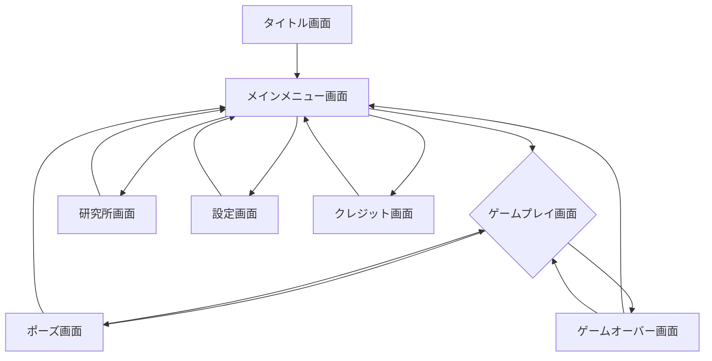

承知いたしました。
ゲーム『バイオセル・ディフェンス・ローグ』の画面遷移定義書を作成します。各画面の概要と、そこからの遷移先を定義します。

---

## 画面遷移定義書：『バイオセル・ディフェンス・ローグ』

### 1. 概要

| 項目 | 内容 |
| --- | --- |
| **ドキュメントバージョン** | 1.0 |
| **作成日** | 2023年10月27日 |
| **作成者** | [作成者名] |
| **プロジェクト名** | バイオセル・ディフェンス・ローグ |

本ドキュメントは、ゲームの各画面の機能と画面間の遷移関係を定義するものです。

### 2. 画面遷移図

*（注：`H --> C` は「リトライ」機能を示します）*

### 3. 各画面の詳細定義

#### 3.1. タイトル画面 (A)

| 画面ID | A |
| --- | --- |
| **画面名** | タイトル画面 |
| **概要** | ゲーム起動後に最初に表示される画面。ゲームのロゴが表示され、プレイヤーの入力を待つ。 |
| **表示要素** | - ゲームロゴ - 「PRESS ANY KEY」または「TAP TO START」等のテキスト - コピーライト表記 |
| **主な機能** | - 入力待機 |
| **遷移先** | - **メインメニュー画面 (B)**: 任意のキー入力または画面タップで遷移。 |

#### 3.2. メインメニュー画面 (B)

| 画面ID | B |
| --- | --- |
| **画面名** | メインメニュー画面 |
| **概要** | ゲームのハブとなる画面。ここから各機能へアクセスする。 |
| **表示要素** | - 「ゲーム開始」ボタン - 「研究所」ボタン - 「設定」ボタン - 「クレジット」ボタン - （未定）「終了」ボタン（PC版のみ） - （未定）プレイヤーのハイスコアや研究ポイントの簡易表示 |
| **主な機能** | - 各画面への遷移 |
| **遷移先** | - **ゲームプレイ画面 (C)**: 「ゲーム開始」ボタンを押下。 - **研究所画面 (D)**: 「研究所」ボタンを押下。 - **設定画面 (E)**: 「設定」ボタンを押下。 - **クレジット画面 (F)**: 「クレジット」ボタンを押下。 - （未定）**ゲーム終了**: 「終了」ボタンを押下。 |

#### 3.3. ゲームプレイ画面 (C)

| 画面ID | C |
| --- | --- |
| **画面名** | ゲームプレイ画面 |
| **概要** | ゲームのメインとなる画面。ユニットの配置、戦闘、強化選択を行う。 |
| **表示要素** | - **盤面エリア**: ユニットを配置するグリッド状のエリア。 - **UIエリア**:    - 現在のウェーブ数 / 敵の残り数   - ラスト・サンプルのHP   - 所持「培養液」数   - 研究レベル(XP)ゲージと現在のレベル   - チームコスト（現在配置数 / 上限）   - ユニットショップ（ユニットのカード、購入コスト、リロールボタン）   - 緊急プロトコル（アクティブスキル）のアイコンとチャージ状況   - ポーズボタン   - （戦闘フェーズ中）早送りボタン   - （準備フェーズ中）ウェーブ開始ボタン - **情報表示エリア**:    - 発動中のシナジー一覧   - （未定）次のウェーブの敵情報 |
| **主な機能** | - ユニットの購入、配置、マージ進化 - ショップのリロール - 研究レベル(XP)の購入 - ウェーブの開始 - 緊急プロトコルの使用 - ポーズ機能 |
| **遷移先** | - **ポーズ画面 (G)**: ポーズボタンを押下。 - **ゲームオーバー画面 (H)**: ラスト・サンプルのHPが0になった場合に自動遷移。 |
| **補足** | - **準備フェーズ**と**戦闘フェーズ**で一部UI（ウェーブ開始ボタン等）の表示/非表示が切り替わる。 - **突然変異選択時**には、画面中央に3つの選択肢カードがオーバーレイ表示される。 |

#### 3.4. 研究所画面 (D)

| 画面ID | D |
| --- | --- |
| **画面名** | 研究所画面（メタプログレッション） |
| **概要** | ゲームオーバー時に獲得した「研究ポイント」を消費して、恒久的な能力を解放・強化する画面。 |
| **表示要素** | - 所持「研究ポイント」数 - 強化項目のツリーまたはリスト（例: 新規ユニット解放、初期リソース増加など） - 各強化項目の説明、コスト、アンロック状況 - 戻るボタン |
| **主な機能** | - 研究ポイントを消費して能力をアンロック/強化する。 |
| **遷移先** | - **メインメニュー画面 (B)**: 「戻る」ボタンを押下。 |

#### 3.5. 設定画面 (E)

| 画面ID | E |
| --- | --- |
| **画面名** | 設定画面 |
| **概要** | ゲームの各種設定を変更する画面。 |
| **表示要素** | - **サウンド設定**: BGM音量、SE音量のスライダー - **グラフィック設定** (PC版): 解像度、品質設定 - **言語設定**: （未定） - 戻るボタン |
| **主な機能** | - 各種設定の変更 |
| **遷移先** | - **メインメニュー画面 (B)**: 「戻る」ボタンを押下。 |

#### 3.6. クレジット画面 (F)

| 画面ID | F |
| --- | --- |
| **画面名** | クレジット画面 |
| **概要** | ゲーム開発に関わったスタッフや使用したアセットの情報を表示する。 |
| **表示要素** | - スタッフロール（テキストがスクロール） - 戻るボタン |
| **主な機能** | - クレジットの表示 |
| **遷移先** | - **メインメニュー画面 (B)**: 「戻る」ボタンを押下、またはスクロール終了後に自動遷移。 |

#### 3.7. ポーズ画面 (G)

| 画面ID | G |
| --- | --- |
| **画面名** | ポーズ画面 |
| **概要** | ゲームプレイ中に表示される一時停止画面。 |
| **表示要素** | - 「ゲームに戻る」ボタン - 「リタイア」ボタン - （未定）「設定」ボタン |
| **主な機能** | - ゲームの一時停止 - ゲームプレイへの復帰 - ゲームプレイの中断 |
| **遷移先** | - **ゲームプレイ画面 (C)**: 「ゲームに戻る」ボタンを押下。 - **メインメニュー画面 (B)**: 「リタイア」ボタンを押下（確認ダイアログを挟むことが望ましい）。 |

#### 3.8. ゲームオーバー画面 (H)

| 画面ID | H |
| --- | --- |
| **画面名** | ゲームオーバー画面 |
| **概要** | ゲームオーバー時に表示されるリザルト画面。 |
| **表示要素** | - 「GAME OVER」のテキスト - **リザルト**:    - 到達ウェーブ数（スコア）   - （未定）プレイ時間、倒した敵の数などの統計情報   - 獲得「研究ポイント」数 - 「リトライ」ボタン - 「メインメニューへ」ボタン |
| **主な機能** | - プレイ結果の確認 - 再挑戦またはメインメニューへの復帰 |
| **遷移先** | - **ゲームプレイ画面 (C)**: 「リトライ」ボタンを押下。研究所で解放した状態を引き継いで、Wave 1から新しいゲームを開始する。 - **メインメニュー画面 (B)**: 「メインメニューへ」ボタンを押下。 |

---